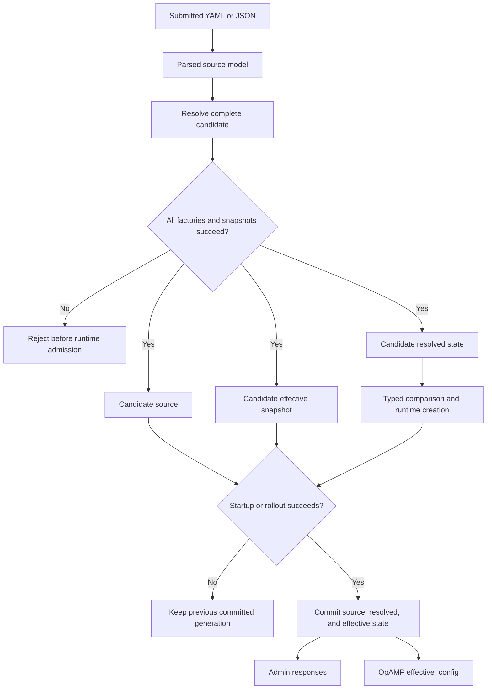

# Factory-Resolved Configuration

This document defines how the OTel Arrow Dataflow Engine turns submitted
configuration into runtime state and safe control-plane snapshots. It is the
architectural reference for component configuration resolution, live
reconciliation, and configuration privacy.

For the user-facing configuration format, see
[Configuration](configuration.md) and the
[configuration model reference](configuration-model.md). For rollout APIs and
operational behavior, see
[Live Pipeline Reconfiguration](admin/live-reconfiguration.md).

## Goals and Boundaries

The configuration lifecycle is designed to:

- parse, validate, default, and normalize component configuration before it is
  admitted to the runtime;
- give runtime components immutable values of their own concrete config types;
- compare runtime meaning rather than submitted JSON syntax or redacted output;
- provide Admin and OpAMP with a precomputed representation that is safe to
  disclose; and
- keep the submitted source model available only to the controller for later
  update construction and diagnostics.

The source artifact is the parsed `OtelDataflowSpec`. The engine does not retain
the original YAML or JSON bytes, comments, aliases, key ordering, or formatting.

Snapshot safety is a disclosure boundary, not encryption. The controller's
private source and resolved values can contain cleartext credentials needed by
the runtime. They must still be protected with process isolation, access
control, and appropriate operational handling.

## Configuration Representations

The controller keeps three distinct representations of an accepted
configuration.

| Representation | Contents | Consumers | Exposure |
| --- | --- | --- | --- |
| Source | Parsed submitted model, including operational inputs | Candidate construction and controller diagnostics | Controller-private |
| Resolved | Immutable, type-erased `Arc<T>` values and typed equivalence callbacks | Runtime creation and reconciliation | Never serialized by the control plane |
| Effective | Normalized envelopes with precomputed safe component snapshots | Admin responses and OpAMP `effective_config` | Safe control-plane representation |

The effective representation keeps the existing engine, group, and pipeline
envelopes. A component's `config` value, however, reflects the factory's
resolved defaults and normalization rather than necessarily preserving the
submitted syntax.

The source representation is not an API response. There is no Admin or OpAMP
endpoint for retrieving unredacted submitted configuration.

## Resolution Lifecycle

The complete candidate is resolved before initial startup or live admission.
This includes regular pipelines, the engine observability pipeline, pipeline
extensions, and controller extensions. Resolution rejects the candidate when
it finds an unknown URN, a parsing or validation error, a snapshot-policy
mismatch, a reserved snapshot marker, or a safe-serialization failure.

Each component resolver is invoked once for a candidate. The resulting typed
value and safe snapshot are reused across pipeline cores, runtime creation,
Admin requests, and OpAMP heartbeats. Those consumers do not parse the
submitted JSON again.

## Factory Resolver Contract

Every receiver, processor, exporter, pipeline extension, and controller
extension factory declares both:

- a resolver that parses, validates, defaults, and normalizes its concrete
  configuration type; and
- one explicit `ConfigSnapshotPolicy` describing how the resolved value may be
  represented in effective configuration.

The factory's creation callback receives a `ResolvedNodeConfig` or
`ResolvedExtensionConfig`. It obtains an immutable `Arc<T>` with the checked
`component_config::<T>()` accessor. A resolver/accessor type mismatch fails with
type information only; the error does not format or expose the submitted value.

Factories must not deserialize component JSON during creation. Multiple cores
share the same resolved value.

### `TypedSafe`

Use `TypedSafe` when the concrete resolved type has an audited `Serialize`
implementation whose complete output is safe to disclose. Typed serialization
materializes defaults and normalized values in the effective snapshot.

Secret fields in an otherwise safe schema must use types with safe
serialization, such as `RedactedString`. A plain `String` containing a secret
does not become safe merely because the surrounding schema is typed.

### `CustomSafe`

Use `CustomSafe` when the component can construct its own safe, normalized JSON
snapshot but ordinary serialization of the runtime type is unsuitable. The
resolver returns both the runtime value and the component-owned safe snapshot.

The custom serializer owns the complete safety of that component subtree. It
must not copy unknown or unaudited submitted fields into the snapshot.

### `Omit`

Use `Omit` when the configuration contains arbitrary properties, raw JSON,
plugin-defined schemas, or any field whose disclosure safety is uncertain. The
effective representation replaces the component's complete `config` value with
the string `[OMITTED]`.

Examples that require conservative omission include Kafka arbitrary
properties, free-form plugin configuration, and raw `serde_json::Value`
payloads. Omission is preferred over partially inspecting an uncertain schema.

There is no fallback to the submitted JSON for any policy. A factory policy is
mandatory, and the policy returned by its resolver must match the policy in the
factory registration.

## Runtime Equivalence and Live Reconciliation

Resolved component values define runtime equivalence. Types that implement
`PartialEq` use their real typed values. Types that cannot use `PartialEq` must
provide a component-owned semantic comparison callback.

Effective snapshots are never used to decide whether a rollout is needed. This
has two important consequences:

- aliases, omitted defaults, or other inputs that resolve to the same runtime
  value can be classified as `noop`; and
- changing only a secret still changes runtime semantics even if both effective
  snapshots contain the same `[REDACTED]` marker.

For a live update, the controller first builds and resolves all three candidate
forms. A pipeline rollout commits its source pipeline, effective pipeline, and
resolved runtime record together only after the rollout succeeds. A failed
admission or successful rollback leaves all three representations at the
previous committed generation.

This representation-level atomicity does not make full-engine reconciliation a
transaction across pipelines. Full-engine reconciliation performs a sequence of
pipeline operations. If an earlier pipeline rollout succeeds and a later one
fails, the earlier committed pipeline remains applied. Each committed pipeline
still has mutually consistent source, effective, and resolved state. Engine and
group metadata are committed only after the overall reconciliation succeeds.

For rollout sequencing, failure handling, and the current consistency scope,
see [Live Pipeline Reconfiguration](admin/live-reconfiguration.md).

## Privacy and Security Model

### Secret Values

`RedactedString` is backed by `secrecy::SecretString` and has the following
contract:

- deserialization accepts the submitted cleartext value;
- runtime code must call `expose()` to access cleartext explicitly;
- serialization emits `[REDACTED]`;
- `Debug` output remains redacted; and
- equality compares the real secret, not the display marker.

Known inline secrets use type-owned safe serialization. These include
ClickHouse passwords, OAuth client secrets and signing keys, static HTTP and
gRPC headers, inline TLS private keys, and credentials embedded in proxy URLs.

`RedactedString` reduces accidental disclosure in snapshots and debug output.
It does not remove cleartext from the submitted source or from the runtime path
that needs the credential.

### Snapshot Markers and Replay

`[REDACTED]` and `[OMITTED]` are display-only markers, not valid replacements
for operational configuration.

- `RedactedString` rejects either marker when parsing a submitted secret.
- A complete component `config: "[OMITTED]"` value is rejected.
- Each top-level value under `engine.custom` is exported as `[OMITTED]`, and
  submitted marker values there are rejected.

These rules prevent an effective snapshot from being silently replayed as if
it contained the original runtime credentials or omitted component data.

### Control-Plane Exposure

Admin engine, group, and pipeline reads serialize the committed effective
representation. OpAMP uses that same stored representation for
`effective_config`. Neither path walks the source model looking for field names
such as `headers`, and neither performs late redaction.

Snapshot policies protect only configuration reporting. They do not replace
authorization on Admin endpoints, transport security for OpAMP, protection of
the process address space, or secure handling of the original submitted
configuration.

## Contributor Checklist

When adding or changing a component factory:

1. Define the concrete normalized runtime config type and its parsing,
   validation, and defaulting behavior.
1. Register a resolver and an explicit snapshot policy for every factory,
   including test factories and no-config factories.
1. Select `TypedSafe` only after auditing every serialized field. Use
   `RedactedString` or another safe type for inline secrets.
1. Select `CustomSafe` only when the component constructs the complete safe
   snapshot itself.
1. Select `Omit` for free-form, plugin-defined, raw-value, or otherwise
   uncertain schemas.
1. Implement `PartialEq` for runtime semantics, or provide a component-owned
   semantic comparator.
1. In creation callbacks, retrieve `Arc<T>` through the checked typed accessor;
   do not deserialize the submitted JSON.
1. Test normalized/default-equivalent inputs, runtime-significant changes,
   secret redaction, omission, marker rejection, and typed accessor failures as
   applicable.
1. Add the required `Scenario` and `Guarantees` comments to every new test.
