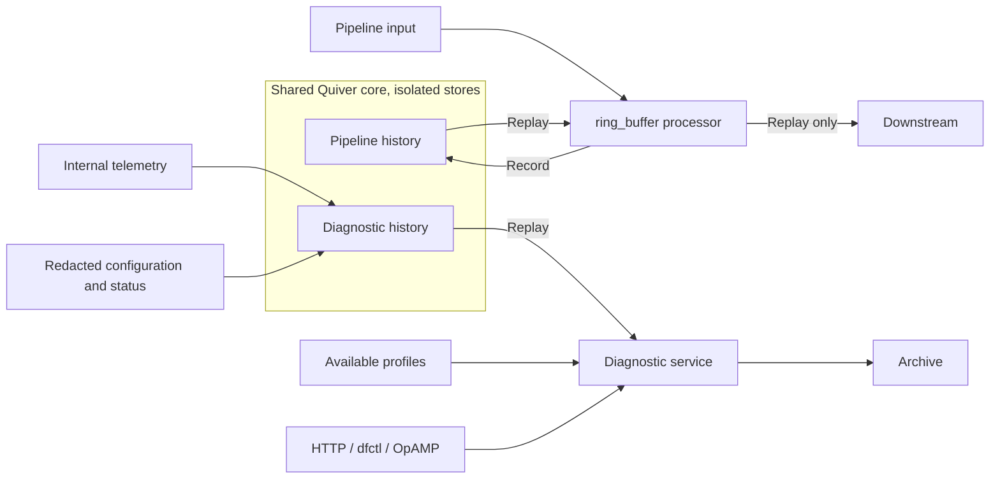

# RFC 0000: Diagnostic Capture and Persistent History

## Summary

Add a diagnostic service that produces an archive of the next or previous
requested observation window. Archives contain internal telemetry, redacted
configuration and status history, and available CPU and heap profiles. HTTP,
OpAMP, and `dfctl` use the same asynchronous capture operations. Historical
recording is opt-in and persists to bounded local storage. A new
`processor:ring_buffer` and the diagnostic service share a Quiver-backed
recording core with retention independent of delivery acknowledgements.
The processor records without forwarding and emits retained signals only during
explicit replay.

## Motivation

Operators need evidence from before an intermittent failure and a way to capture
a problem while reproducing it. They also need to connect changes in telemetry
to configuration changes, rollouts, and runtime failures.

Today, `dfctl` support bundles combine current status, retained logs, and metrics.
They do not preserve a requested observation window or complete configuration
history. The admin server also exposes CPU and heap profiling separately.
Neither facility provides a common archive operation for remote management.

This proposal makes those investigations possible for one engine instance,
including evidence retained across its restarts. It captures the engine's own
activity; customer telemetry passing through user pipelines is outside the
diagnostic archive's scope.

## Guide-level explanation

### Two capture modes

A capture has a fixed telemetry and configuration/status window, anchored at
the engine's acceptance time `t0`. Profiles have their own recorded observation
times. Collection continues if the requesting client disconnects.

| Mode | Window | Requirement |
| --- | --- | --- |
| On demand | `[t0, t0 + duration)` | Diagnostics enabled; no prior recording required |
| Time travel | `[t0 - duration, t0)` | History recorded before the request |

```console
dfctl diagnostics capture --duration 5m --file next-5m.tar.gz
dfctl diagnostics capture --lookback 5m --file last-5m.tar.gz
```

These commands create a capture, wait for completion, and download its archive.
They print the capture ID for subsequent status or retrieval requests. Partial
archives are downloaded with a visible coverage warning.
Existing `groups bundle` and `pipelines bundle` commands retain their current
point-in-time behavior.

Diagnostics are disabled by default. Enabling the service configures a private
persistent directory and limits for capture duration, memory, disk, concurrent
jobs, and archive retention. Continuous recording is a separate opt-in setting,
with both a retention duration and a byte cap. With continuous recording off,
only active on-demand captures record new telemetry and configuration/status
history; either capture mode can trigger profiling.

The retention duration is a target: the byte cap can shorten actual history.
A request with no usable retained history reports `history_unavailable`;
incomplete history produces an archive that identifies its gaps.

### Archive contents

| Content | Meaning |
| --- | --- |
| Internal telemetry | All emitted internal metrics and logs/events at configured levels and sampling rates; internal traces when a source exists |
| Configuration and status | A baseline plus changes and outcomes throughout the window, with sensitive data masked |
| Profiles | Available CPU sampling intervals and timestamped heap allocation profiles |
| Manifest | Requested and actual coverage, source availability, losses, redactions, and engine/build identity |

Capture preserves configured telemetry detail. Internal traces are currently
[unimplemented](../docs/telemetry/implementation-gaps.md); the manifest reports
that source as unavailable rather than implying an empty trace interval.

Both modes trigger supported CPU and heap profiling when the request is accepted,
unless excluded by the request or local policy. A time-travel archive combines
historical telemetry and configuration/status with profiles of current activity:
a heap snapshot at request time and a short CPU capture starting then. For
example, `--lookback 5m` includes the previous five minutes of history and, by
default, the next 30 seconds of CPU samples. The archive is ready after profiling
and packaging finish. It can also include retained profiles overlapping the
historical window. Continuous profiling is outside this RFC.

### Ring-buffer recording and replay

The ring-buffer processor has two operating modes, separate from the diagnostic
capture modes above:

| Mode | Behavior |
| --- | --- |
| Recording (default) | Store incoming signals within retention limits; emit no telemetry downstream |
| Replay | Emit all retained signals selected by a time window or byte limit, then return to recording |

Replay reads a fixed snapshot, preserves original telemetry timestamps, and does
not consume history. New arrivals continue recording without joining the active
replay. To export live signals as well, use a separate pipeline branch.
The replay trigger remains open: a dedicated control command is recommended;
a special event or future targeted reconfiguration are alternatives.

## Reference-level explanation

### Shared recording core

Extend Quiver with a rolling-history retention mode and a repeatable replay-read
interface. Keep WAL, segment encoding, recovery, and disk accounting shared with
the existing [durable buffer][durable-buffer]. Add
`urn:otel:processor:ring_buffer` in `core-nodes`,
with primary metric scope `processor.ring_buffer`, as a thin pipeline adapter
over this core.

The existing durable buffer deletes fully consumed segments. Its `drop_oldest`
and `max_age` settings therefore do not retain a history of successfully
delivered data. Rolling history must remain readable until age or capacity
eviction, regardless of delivery acknowledgements or previous archive reads.

The ring-buffer processor admits input through a bounded queue and records it
without forwarding live payloads. Upstream success acknowledges recording under
the configured flush policy, not downstream delivery; admission or write failures
are reported as recording failures. Lifecycle/control messages and the
processor's own health telemetry remain available in either mode. Recovery
returns to recording; it never automatically emits retained history.

The controller owns diagnostic jobs and a handle to the shared recording core.
Diagnostics feed that core directly through independent bounded subscriptions
to internal telemetry and controller/state transitions. This avoids depending
on exporter progress or introducing a second competing
`internal_telemetry` receiver. The processor exposes recording and downstream
replay for pipeline composition; the service uses the same replay-read interface
to feed archive generation. Diagnostics use a dedicated, stable store namespace
with exclusive writer ownership and do not include user-pipeline recorder
stores. Enabling diagnostics requires no edits to the observability pipeline.



Telemetry subscriptions belong in `telemetry`; configuration/status recording
hooks belong in `controller` and `state`. Admin DTOs live in `admin-types`, with
HTTP handlers in `admin` and client methods in `admin-api`. `ctl` and the OpAMP
controller extension adapt those operations.

[durable-buffer]: ../crates/core-nodes/src/processors/durable_buffer_processor/README.md

### Replay contract and trigger options

A replay selects an observation-time window or the newest retained records
fitting a requested byte limit, measured in stored record bytes. If both are
specified, apply the byte limit within the window. Size-limited selection takes
the newest contiguous suffix of whole recorded batches. Freeze the selection
at a snapshot boundary. Emit every selected signal without additional sampling,
preserving payloads, timestamps,
and per-stream recording order; no global order across streams is implied.
Report actual coverage, eviction gaps, and size truncation.

Replay respects downstream backpressure with bounded in-flight data and the
snapshot leases described below. New input remains recording-only. Completion,
cancellation, or failure releases the snapshot and returns the processor to
recording; downstream acknowledgements never delete history. Downstream failure
is reported, not counted as successful replay. Replay does not promise
exactly-once external delivery, and an explicit new replay may resend records.
Cancellation stops further emission but cannot recall already emitted records.

Keep the trigger transport open while defining one common replay operation:
target recorder instance/store, request ID, selection, progress, cancellation,
and terminal result. Bound concurrent replays and request-ID retention;
duplicates within that retention must not start another replay. Reject stale
runtime targets instead of silently addressing a replacement instance.

| Trigger option | Considerations |
| --- | --- |
| Dedicated control-plane command (recommended) | Carries selection and request identity without changing pipeline topology; can use an addressed node-control message or replay-service handle |
| Special event | Composable with incident detection; requires an explicit trusted control envelope, consumed before recording so it cannot replay and trigger itself |
| Targeted reconfiguration, once supported | Reuses configuration machinery; needs one-shot request identity and must avoid unintended rollout or retriggering during reconciliation |

The engine already has [node-addressed control messages][node-control], but no
replay command. Current [live control][live-control] manages pipeline rollouts;
an in-place recorder trigger is additional work. Final command schema and
transport remain unresolved. HTTP, OpAMP, and `dfctl` capture requests need not
expose that internal choice: they invoke the shared diagnostic service.

[node-control]: ../crates/engine/src/control.rs
[live-control]: ../crates/controller/src/live_control/README.md

### Collection and history

Record internal metrics before exporter transformations, using an independent
collection view. Preserve resource/scope/item attributes, temporality, start
times, and full histogram data. Diagnostic reads must not drain or reset the
admin or internal telemetry export accumulators. Logs/events retain structured
fields and source timestamps after privacy filtering.

Record configuration proposals, accepted revisions, rejected-change outcomes,
rollout/shutdown progress, and observed status transitions at their authoritative
update points. Failed proposals contain only safely redacted content and error
details. Link records with group/pipeline IDs, configuration revisions,
deployment generations, and process incarnation IDs. Configuration revision and
observed runtime generation remain distinct during a rollout.

Checkpoint configuration and status when recording starts, then journal changes.
Use snapshot-plus-sequence boundaries so concurrent changes are neither missed
nor counted twice. Retain the baseline needed by the oldest remaining history,
even when its last configuration change predates the window. A lost transition
marks a gap; a subsequent checkpoint restores interpretable state.

Persist observation timestamps, sequence numbers, and process incarnation IDs
with recorded batches/changes. Window selection uses observation time while
preserving source timestamps. Use monotonic time for live durations and UTC for
persisted history; record clock discontinuities. Quiver's segment-finalization
age is not an observation-window index: add persisted observation bounds and
filter boundary segments on export. Keep actual metric intervals; do not
prorate values at window boundaries.

Recovery retains valid persisted records in the same configured directory and
reports discontinuities, including any uncommitted tail. An interrupted capture
is finalized from recoverable data as partial after restart, without extending
its original window or restarting profiles. Persistent volume lifetime and
Quiver's configured flush policy bound recovery guarantees.

### Bounded resources and failures

Keep disk and archive waits off pipeline hot paths and controller/state locks.
Bound queues by bytes and entries, reject
oversized records, and count admission drops. Run encoding, disk work, profile
generation, and compression on bounded workers. Rate-limit recorder error
reporting to avoid recursive telemetry storms.

Evict oldest eligible history when its age or byte limit is reached. A single
diagnostic storage budget accounts for WAL, open/finalized segments, checkpoints,
profiles, reader-held files, archive staging, and completed archives. Reserve
headroom for in-flight writes and finalization; Quiver's watermark alone does
not strictly reserve capacity across those consumers.

Capture and replay admission reserve bounded storage for preserving selected
history or accumulating an upcoming window. Snapshot leases have byte limits
and deadlines, including for standalone processors. Slow readers cannot pin
history indefinitely or raise the disk cap.
When a reservation cannot be granted, reject the job as resource exhausted;
if an admitted capture reaches its limit, finalize available evidence as partial.
An exhausted replay lease terminates replay with explicit incomplete coverage.
Release leases on cancellation or failure. Archive expiry is independent of
history retention. Disk failures must not block user pipelines.

### Profiling and archive format

Reuse the CPU and heap profiling implementations behind the admin debug
endpoints through a shared coordinator, including their concurrency limits.
Availability depends on platform, build, and allocator; capture does not
activate allocator profiling. A busy or unsupported
profiler leaves the other evidence available, with a reason in the manifest.

On demand, sample CPU over the capture window within configured profile limits,
and take supported heap snapshots at the start and end. For time travel, take a
heap snapshot and start CPU sampling when the request is accepted. Its CPU
duration defaults to 30 seconds and can be overridden independently of the
lookback duration, subject to local limits. Pin the historical window at `t0`
while profiling runs; waiting for profiles does not move or extend that window.

Preserve each profile's actual interval or snapshot time, mark it as process-wide,
and identify whether it was collected for this request or reused from history.
Request-triggered time-travel profiles describe current activity and do not
count toward historical profile coverage. Also include available retained CPU
profiles overlapping the historical window and heap snapshots within it;
overlapping CPU profiles retain their original coverage. Allocation profiles
are not raw heap-memory dumps.

Export a versioned `.tar.gz` with the following logical layout:

```text
manifest.json
telemetry/{logs,metrics,traces}/<batch>.otlp
configuration/baseline.json
configuration/changes.jsonl
status/baseline.json
status/events.jsonl
profiles/<profile>.pprof
```

Each telemetry file contains one serialized OTLP export request for its signal.
Absent sources have no data files and an explicit manifest entry. The manifest
lists file checksums, format and redaction-policy versions, engine/build/process
identity, requested bounds, actual per-source coverage, telemetry settings, and
drop/gap counts where known. Unknown loss is not reported as zero. Source
failures can produce a valid partial archive; packaging failure produces a
failed job without advertising a downloadable archive.

### Capture operations

All transports use the same job model and locally configured limits.

| HTTP operation | Behavior |
| --- | --- |
| `GET /api/v1/diagnostics` | Report capabilities, effective limits, and available history |
| `POST /api/v1/diagnostics/captures` | Create a capture; return `202` with its ID and status location |
| `GET /api/v1/diagnostics/captures/{id}` | Get capture, coverage, archive-expiry, and upload status |
| `POST /api/v1/diagnostics/captures/{id}/cancel` | Cancel active work and release its reservations |
| `GET /api/v1/diagnostics/captures/{id}/archive` | Download a completed archive |
| `DELETE /api/v1/diagnostics/captures/{id}` | Remove a terminal job and its local archive |

A create request specifies `mode` (`on_demand` or `time_travel`), `duration`,
optional profile selection, an optional named upload destination, and a client
request ID. Time travel also accepts `cpu_profile_duration` (default: 30 seconds),
exposed by `dfctl` as `--cpu-profile-duration`. Reject zero or excessive durations
before reserving work. Reusing
a request ID with the same parameters returns the existing job and fixed
window; conflicting parameters are rejected. Preserve this association across
restarts and deletion, as a bounded tombstone until job-retention expiry.

Jobs progress from `recording` to `packaging` to `ready`. The recording phase
includes live profiling: a time-travel job preserves its historical window while
collecting current profiles, then packages both. If no live profiles will be
collected, time travel starts with packaging. Terminal alternatives are
`failed`, `cancelled`, and `expired`.
A ready archive has an explicit completeness assessment. Cancellation produces
no archive and does not erase rolling history. `dfctl diagnostics` also provides
status, download, cancel, and delete commands using the shared admin client.

OpAMP advertises `io.opentelemetry.otap.diagnostics/v1` as a custom capability.
After capability agreement, UTF-8 JSON custom messages carry `create`, `status`,
`cancel`, and `delete` requests and correlated `result` responses. Create and
status use the same models as HTTP. This is an engine-specific extension.
Bound message queues and keep heartbeats,
configuration handling, and existing status reports responsive.

Archives are downloaded over admin HTTP or optionally uploaded with HTTPS PUT
to an operator-configured destination. Capture requests select a destination
name, not arbitrary URLs or credentials. Upload uses bounded retries and
timeouts; redirects cannot escape the configured destination. Upload failure
does not invalidate the local archive. OpAMP status reports its outcome and
artifact identifier without carrying archive bytes.

### Security and privacy

Redact before any diagnostic persistence, including WAL, checkpoints, metadata,
and temporary files. Existing configuration snapshot redaction covers credential
headers but is insufficient for inline keys, URL credentials, and opaque
component secrets. Use explicit safe-field policies for known configuration;
mask opaque subtrees unless covered by such a policy. There is no raw-config
override. Identify revisions without persisting hashes of raw secrets.

Apply the [telemetry privacy rules](../docs/telemetry/security-privacy-guide.md)
to bodies, attributes, status errors, profile labels/paths, and request metadata.
Omit unsafe content and report the omission. Archives still expose
operational topology and profiles: use private filesystem permissions, bounded
retention, and protected transport access. Current admin HTTP has no native
authentication; remote diagnostic access requires an authenticated gateway.
Remote OpAMP triggers require an authenticated management connection and an
explicit local capability opt-in. Upload credentials never enter an archive.

### Acceptance criteria

- Both modes select the declared window, with empty, partial, and unavailable
  sources distinguished. Repeated reads do not consume history.
- Recording emits no downstream telemetry. Replay emits every selected signal
  with original timestamps, obeys time/byte limits, and excludes new arrivals.
  Duplicate triggers do not start another replay; completion, cancellation,
  failure, and restart leave the processor recording-only.
- Downstream acknowledgements do not remove ring history. Restart recovers it
  without replay, preserves revision context, and reports interrupted captures.
- Concurrent configuration changes are recorded around baseline boundaries;
  eviction and dropped transitions cannot imply a complete history.
- Existing live telemetry export paths remain unchanged. Stalled exporters,
  replay backpressure, slow readers, full disk, and saturated queues obey
  resource bounds without stalling independent diagnostic recording.
- Time travel triggers current profiles without shifting its historical window.
  Profiles report actual coverage, request-versus-history origin, and
  unavailable/busy states. Disabling profiles skips the live profiling wait;
  duplicate requests do not restart profiling.
- Sensitive fixtures remain absent from WAL, archives, manifests, and errors.
  HTTP, CLI, and OpAMP agree on job status; retries do not create duplicate jobs.
- Archive checksums and OTLP/pprof decoding succeed. Upload failure preserves
  local retrieval. Benchmarks measure recording and capture overhead separately.

## Drawbacks

Persistent recording adds disk writes, retention management, and ongoing resource
cost. Profiles and archive generation can perturb the process being investigated.
Conservative masking removes potentially useful evidence, and bounded recording
cannot guarantee a complete window under overload or storage failure. Quiver
needs new read and retention semantics; existing queue behavior is insufficient.

## Rationale and alternatives

- **A mode on `durable_buffer`:** shares storage but combines live delivery/retry
  semantics with silent recording and explicit, non-consuming replay. A separate
  processor keeps those contracts explicit while reusing Quiver underneath.
- **An independent recorder store:** could specialize its file format, but
  duplicates recovery and storage accounting already provided by Quiver.
- **An ordinary observability pipeline branch:** is composable, but upstream
  exporter backpressure can prevent incident evidence from reaching it.
  Independent bounded subscriptions isolate diagnostic collection.
- **Memory-only retention:** reduces storage work but loses evidence on restart.
- **External backends or current support bundles:** remain useful, but cannot
  ensure local configuration history and evidence during exporter/network
  failures. They do not satisfy both requested observation modes.

## Prior art

[Go's flight recorder](https://go.dev/blog/flight-recorder) demonstrates bounded
recent-history capture after an incident. Its in-memory execution traces differ
from this proposal's persistent, multi-source archive.

The [Collector pprof extension][collector-pprof] provides separate profile
endpoints. The local admin implementation already follows that access pattern;
this RFC adds coordinated capture and coverage metadata.

[OpAMP custom messages][opamp-custom] support capability-specific exchanges;
their content must be agreed by agent and server. They provide the control
mechanism here, with archive transfer handled separately.

[collector-pprof]: https://github.com/open-telemetry/opentelemetry-collector-contrib/tree/main/extension/pprofextension
[opamp-custom]: https://opentelemetry.io/docs/specs/opamp/#custom-messages

## Unresolved questions

- Which replay trigger should ship first: an addressed control command, a
  special event, or future targeted reconfiguration? The common replay contract
  should support adapters without depending on one transport.
- Which retention, queue, profile, and archive-size defaults provide useful
  evidence at acceptable cost on small agents and high-volume gateways?
- Should the first implementation expose Quiver's flush policy directly or
  provide a diagnostic preset with a documented maximum uncommitted interval?

Tuning decisions require measurements; opt-in recording, bounded storage,
pre-persistence masking, and explicit coverage remain requirements.

## Future possibilities

Continuous CPU profiling and periodic heap snapshots could improve historical
coverage with a separate opt-in cost. Other extensions include combined
before/after windows, automatic incident triggers, offline archive inspection,
and coordinated fleet captures. Internal trace recording can join when its
instrumentation source is implemented. Including user-pipeline recorder stores
in diagnostic archives requires a separate privacy and access-control design;
processor replay alone does not authorize that inclusion.
